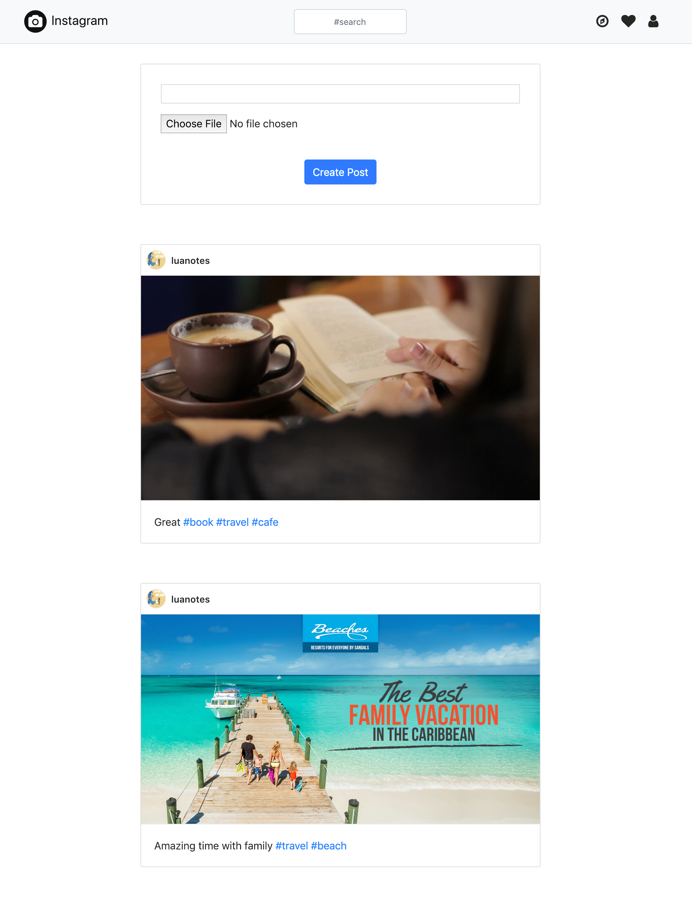
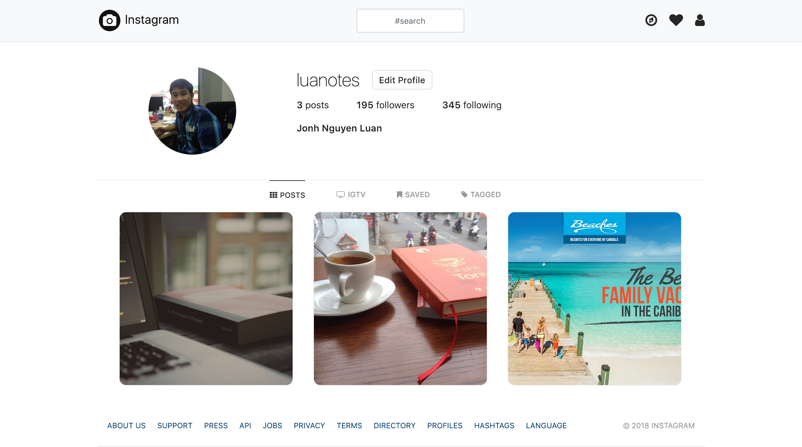
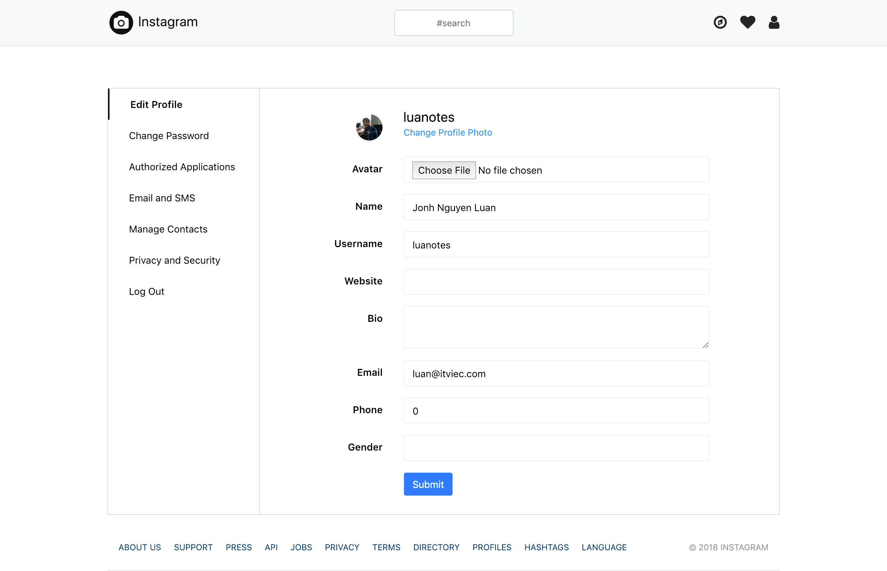
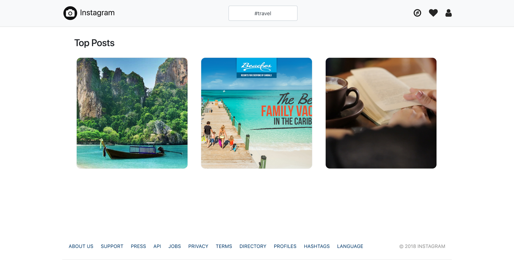

## Build Instagram by Ruby on Rails
I’ll guide you step by step learning Ruby on Rails through building the Instagram application.

## What’ll you learn after complete this project?
- How to start a new Rails application?
- Design System from Craft
- Understanding MVC (Model — View — Controller) architecture
- Model: Active Record migration, validation, callback, association, and query interface
- View: Layout, Partial and Form helpers
- Controller: Actions, Strong Parameters
- Rails Routing
- Active Storage to upload files
- Using Bootstrap, Devise, Kaminari gem in Rails application

## Tech Stacks
- Back-end:
    - Ruby 2.4
    - Rails 5.2.x
    - Database: Postgres 9.6
    - Gems: Devise, Kaminari, Bootstrap
- Front-end:
    - HTML, CSS, Javascript, jQuery
    - Bootstrap (3.x or 4.x)

## Table of Contents:
- Part 1: [medium.com/luanotes/build-instagram-by-ruby-on-rails-part-1](https://medium.com/luanotes/build-instagram-by-ruby-on-rails-part-1-fef7837ee399)
- Part 2: [medium.com/luanotes/build-instagram-by-ruby-on-rails-part-2](https://medium.com/luanotes/build-instagram-by-ruby-on-rails-part-2-d70b44f5c7e6)
- Part 3: [medium.com/luanotes/build-instagram-by-ruby-on-rails-part-3](https://medium.com/luanotes/build-instagram-by-ruby-on-rails-part-3-2cb65dca46d7)

## Main functions:

### Homepage

### User Profile Page

### Edit User Page

### Search Page

