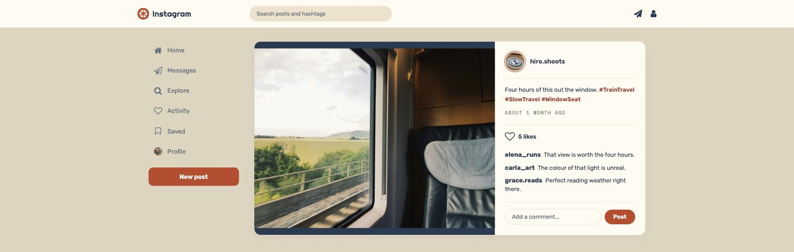

## Build Instagram by Ruby on Rails

[](https://github.com/thanhluanuit/instuigram/actions/workflows/ci.yml)
[](.ruby-version)
[](Gemfile.lock)

**Instuigram** is an Instagram clone built on Ruby on Rails, covering what a real Rails application needs beyond CRUD: authentication, background jobs, caching, full-text search, real-time direct messaging, a follow graph, and a CI pipeline that enforces security and style on every change to `master`.

## Screenshots


<details>
<summary>Profile, follow and post detail</summary>




</details>

## Key features

- **Posts** — image upload through Active Storage with named variants, `#hashtags` parsed out of the description on create, comments and six emoji reactions, and an infinite-scroll feed
- **Chat** — one-to-one conversations with live delivery, unread badges and online presence
- **Follow** — a self-join social graph with counter-cached totals and live button and count updates
- **Search and Explore** — Elasticsearch across post descriptions and hashtags plus username matching; `/explore` surfaces posts from people you don't follow yet
- **JSON API** — a token-authenticated `/api/v1` surface: machine credentials exchanged for a short-lived JWT, both entry points rate-limited
- **Event log** — key domain events (posts, comments, reactions, follows, messages, profile updates) written asynchronously to an audit table

The two features worth reading the code for:

### Chat

One-to-one messaging with live delivery. A sent message reaches the other browser
immediately — the unread badge ticks up and the thread jumps to the top of their inbox,
wherever they are in the app. A dot on each avatar shows who is online.

- **One thread per pair.** `Conversation.participants_key_for` sorts the two user ids into a
  `participants_key` carrying a unique index, so
  [`Conversations::FindOrCreate`](app/services/conversations/find_or_create.rb) can never
  open a second thread for the same two people.
- **One service owns the write.** [`Messages::Create`](app/services/messages/create.rb)
  saves the message, updates the conversation's last-message columns and adjusts unread
  counts in a single transaction, then broadcasts once it commits.
- **Two broadcasts, two audiences.** `ConversationChannel` pushes rendered HTML to whoever
  has the thread open; `InboxChannel` pushes JSON so badges and inbox rows update anywhere.
- **Presence needs no extra table.** `PresenceChannel` touches `users.last_seen_at` on a
  timer, with `HEARTBEAT_INTERVAL` derived as `ONLINE_WINDOW / 2` so nobody flickers
  offline between pings.

Threads are 1:1 by construction — no group chats, typing indicators or attachments.

### Follow

Follow and unfollow from a profile, a post header, the people results in search, or the
suggestions rail. Counts and button state update without a reload, in every tab you have
open at once.

- **Counts are counter caches**, not `COUNT(*)` — `users.followers_count` and
  `users.following_count`, maintained by `Follow`'s two `counter_cache` declarations.
- **The database rejects duplicates and self-follows** — a unique index on
  `[follower_id, followed_id]` and a `follows_no_self_follow` check constraint sit behind
  the model validations, so [`Follows::Create`](app/services/follows/create.rb) stays
  idempotent under a double click.
- **Two broadcast streams.**
  [`Follows::BroadcastCounts`](app/services/follows/broadcast_counts.rb) replaces the count
  partials on both profiles;
  [`Follows::BroadcastButton`](app/services/follows/broadcast_button.rb) replaces every
  follow button on the actor's own stream, so one click flips them all.
- **Discovery reads the graph.** `User.suggested_for` fills the suggestions rail and
  `Post.discoverable_for` fills `/explore`, both by excluding people you already follow.

The home feed is deliberately *not* follow-filtered — it stays global and
reverse-chronological, and follow state only decides whether a post header offers a Follow
button. Following someone sends no notification; it writes an `EventLog` row.

## Architecture

Standard Rails MVC. `User` and `Post` are each split into concerns under `app/models/user/`
and `app/models/post/` rather than growing into god objects, and multi-step writes live in
`app/services/` instead of controllers or model callbacks.

**Domain model** — Devise-authenticated, PostgreSQL-backed:
- `User` → has many `posts`, an avatar via Active Storage; behaviour split across `Followable`, `Conversable`, `Avatarable` and `Presenceable`
- `Post` → belongs to a user, one attached image, auto-extracted `#hashtag` associations, indexed into Elasticsearch on commit; behaviour split across `Imageable`, `HashTaggable` and `Searchable`
- `Comment` and `Reaction` (polymorphic, emoji-style: like/love/haha/wow/sad/angry) attach to posts
- `Follow` → the social graph, a self-join across `users` with a counter cache on each side
- `Conversation` / `ConversationParticipant` / `Message` → 1:1 direct messaging, with a per-participant unread count
- `HashTag` / `PostHashTag` → many-to-many tagging, populated from post descriptions
- `EventLog` → a lightweight audit trail of key domain events (post created/destroyed, profile updated, comment/reaction/follow created, message sent), written asynchronously

**Real-time** — four Action Cable channels, each authenticated from the Devise session:
`PostChannel` (reaction and comment counts), `ConversationChannel` (messages in an open
thread), `InboxChannel` (unread badges and inbox rows) and `PresenceChannel` (online status).
Follows, comments and reactions additionally broadcast declaratively through
`Turbo::StreamsChannel`, so the app runs both a hand-written and a declarative real-time path
on purpose.

**JSON API** (`/api/v1`) — a separate, token-authenticated surface alongside the session-based web app:
- `POST /api/v1/clients` — verifies an email and password, then issues machine credentials (`client_id` / `client_secret`, stored with `has_secure_password`)
- `POST /api/v1/oauth` — exchanges those credentials for a short-lived JWT (1h) via a client-credentials-style flow
- `Api::V1::PostsController` — exposes posts (index/show/create/destroy) to authenticated API clients, scoped to the token's own user
- Both unauthenticated endpoints are throttled with Rails 8's native `rate_limit`

## Tech Stack

**Back-end**
- Ruby 3.3.11 · Rails 8.1.3.1 
- PostgreSQL — primary database
- Redis — Rails cache store, Sidekiq queue backend, and Action Cable pub/sub
- Sidekiq 8.1 — background job processing
- Elasticsearch 8.x — full-text search
- Puma 8 — application server
- Devise 5 (authentication) · Kaminari (pagination) · Active Storage (file uploads)
- `image_processing` + `mini_magick` — Active Storage named variants, shelling out to ImageMagick rather than libvips
- JWT — token issuance for the `/api/v1` surface

**Real-time**
- Action Cable over Redis, with hand-written Stimulus controllers — `ConversationChannel`, `InboxChannel`, `PresenceChannel`, `PostChannel`
- Turbo Streams via declarative `turbo_stream_from` — follow buttons, follower counts, comments and reactions

**Front-end**
- Server-rendered ERB
- Turbo + Stimulus via importmap-rails — no npm build step, `package.json` has zero dependencies
- Bootstrap 5.3 (CSS only, no jQuery) via sassc-rails/SCSS, with every colour, radius and shadow a token in `_tokens.scss`
- Self-hosted woff2 webfonts and Font Awesome 4 icons — the app's CSP is `style_src :self` / `font_src :self, :data`, which rules out Google Fonts
- Sprockets serves CSS, fonts and images; importmap-rails serves all JS

**Quality & security**
- Minitest — model, controller, service, channel, job and Capybara/Selenium system tests
- SimpleCov — coverage report generated on every local `bin/rails test`
- RuboCop (`rubocop-rails-omakase`) — style
- Brakeman 8 — static security analysis
- bundler-audit — dependency CVE scanning
- `bullet` — N+1 query detection in development and test
- `annotaterb` — schema annotations above each model, with CI failing on drift
- CI runs five independent, parallel GitHub Actions jobs on every push to `master` and every pull request targeting it: `brakeman`, `bundler_audit`, `rubocop`, `test` and `system_test` (Rails' default test glob excludes `test/system`, so the browser suite needs its own job)

## Getting Started

**Prerequisites** — Ruby 3.3.11 (managed with RVM; `.ruby-version` and `.ruby-gemset` are
committed), PostgreSQL, Redis, ImageMagick, and an Elasticsearch 8 node.

```bash
bundle install

# Services. docker-compose.yml defines Elasticsearch only —
# Postgres and Redis are expected on the host.
docker compose up -d                       # Elasticsearch on localhost:9200
brew services start postgresql@14 redis    # or however you prefer to run them

bin/rails db:create db:migrate
bin/rails db:seed                 # sample users and posts; prints the generated password
bin/rails elasticsearch:reindex   # create the Post index and backfill

bundle exec sidekiq               # second shell: search indexing and event logging
bin/rails server                  # http://localhost:3000
```

Redis is not optional in development — it backs the cache store, the Sidekiq queue and
Action Cable, so chat, presence and live counts all need it. Any Elasticsearch 8 node will
do; the app reads `ELASTICSEARCH_URL` (default `http://localhost:9200`), `REDIS_URL`
(Sidekiq and Action Cable, default DB 1) and `REDIS_CACHE_URL` (the cache store, default
DB 2, kept separate so cache keys can't collide with queue data).

Seeds are split so either half can run on its own — `bin/rails db:seed:users` and
`bin/rails db:seed:posts`. Sample avatars and post images live under `db/seeds/`.

Run the test suite with `bin/rails test`, and the browser tests with
`bin/rails test:system` (headless by default; `HEADED=1` opens a real Chrome window).

## What you'll learn from this project

- Bootstrapping a Rails app and structuring it around MVC
- Active Record: migrations, validations, callbacks, associations, and the query interface
- Views: layouts, partials, and form helpers
- Controllers: actions and strong parameters
- Rails routing
- File uploads with Active Storage
- Authentication with Devise, pagination with Kaminari
- Background jobs with Sidekiq and caching with Redis
- Full-text search with Elasticsearch
- Real-time UI with Action Cable and Turbo Streams, no SPA framework
- Keeping a growing model tidy: concerns, service objects, and counter caches
- Standing up a token-authenticated JSON API alongside the session-based web app

## Article Series on Medium

This project began life as a step-by-step Medium series walking through building it from scratch:

- [Build Instagram by Ruby on Rails (Part 1)](https://medium.com/luanotes/build-instagram-by-ruby-on-rails-part-1-fef7837ee399) — 👏 2K · 💬 11
- [Build Instagram by Ruby on Rails (Part 2)](https://medium.com/luanotes/build-instagram-by-ruby-on-rails-part-2-d70b44f5c7e6) — 👏 628 · 💬 9
- [Build Instagram by Ruby on Rails (Part 3)](https://medium.com/luanotes/build-instagram-by-ruby-on-rails-part-3-2cb65dca46d7) — 👏 578 · 💬 3

