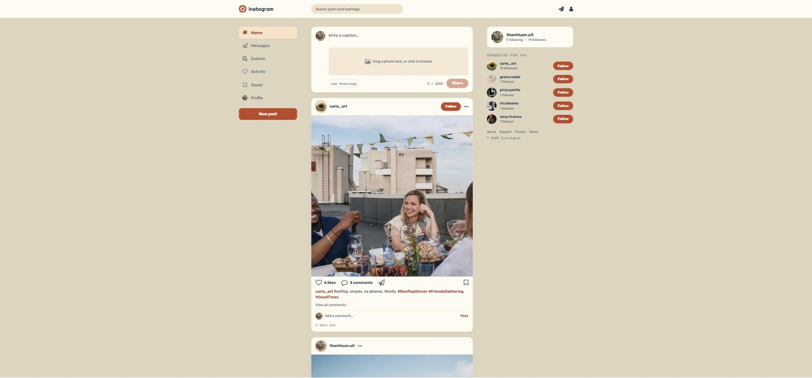
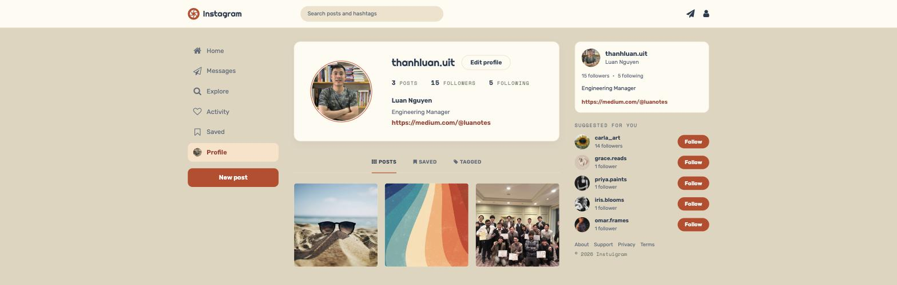
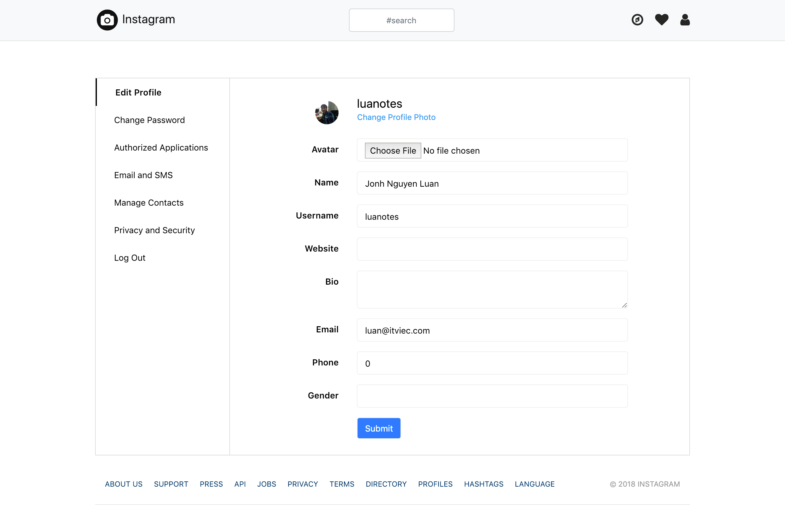
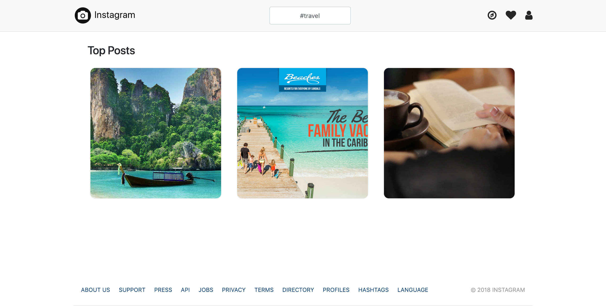

## Build Instagram by Ruby on Rails

[](https://github.com/thanhluanuit/instuigram/actions/workflows/ci.yml)
[](.ruby-version)
[](Gemfile.lock)

**Instuigram** is an Instagram clone built on Ruby on Rails, covering what a real Rails application needs beyond CRUD: authentication, background jobs, caching, full-text search, real-time updates, and a CI pipeline that enforces security and style on every push.

## What you'll learn from this project

- Bootstrapping a Rails app and structuring it around MVC
- Active Record: migrations, validations, callbacks, associations, and the query interface
- Views: layouts, partials, and form helpers
- Controllers: actions and strong parameters
- Rails routing
- File uploads with Active Storage
- Authentication with Devise, pagination with Kaminari
- Background jobs with Sidekiq and caching with Redis
- Full-text search with Elasticsearch

## Tech Stack

**Back-end**
- Ruby 3.3.11
- Rails 8.1.3.1
- PostgreSQL — primary database
- Redis — Rails cache store, Sidekiq queue backend, and Action Cable pub/sub (`redis` gem 5.4; CI runs Redis 7)
- Sidekiq 8.1 — background job processing
- Elasticsearch 8.x
- Devise (authentication) · Kaminari (pagination) · Active Storage (file uploads)
- JWT 3.2 — token issuance for the `/api/v1` surface

**Front-end**
- Server-rendered ERB
- Turbo 2 + Stimulus 1.3 via importmap-rails (no npm build step)
- Bootstrap 5.3 (CSS only, no jQuery) via sassc-rails/SCSS

**Quality & security**
- Minitest — unit, integration, and Capybara/Selenium system tests
- RuboCop (`rubocop-rails-omakase`) — style
- Brakeman 8 — static security analysis
- bundler-audit — dependency CVE scanning
- All of these run as independent, parallel GitHub Actions jobs on every push — five in total: `brakeman`, `bundler_audit`, `rubocop`, `test` and `system_test` (Rails' default test glob excludes `test/system`, so the browser suite needs its own job)

## Architecture

**Web app** — standard server-rendered Rails MVC, Devise-authenticated:
- `User` → has many `posts`, an avatar via Active Storage
- `Post` → belongs to a user, one attached image, auto-extracted `#hashtag` associations, indexed into Elasticsearch on commit
- `Comment` and `Reaction` (polymorphic, emoji-style: like/love/haha/wow/sad/angry) attach to posts — reactions broadcast live over ActionCable (`PostChannel`) so like counts update in-browser without a refresh
- `EventLog` records key domain events (post created/destroyed, profile updated, comment/reaction created) as a lightweight audit trail

**JSON API** (`/api/v1`) — a separate, token-authenticated surface alongside the session-based web app:
- `Client` issues machine credentials (`client_id` / `client_secret`, `has_secure_password`)
- `POST /api/v1/oauth` exchanges those credentials for a short-lived JWT (1h) via a client-credentials-style flow
- `Api::V1::PostsController` exposes posts (index/show/create/destroy) to authenticated API clients

## Getting Started

```bash
bundle install
docker compose up -d              # start Elasticsearch
bin/rails db:create db:migrate    # set up the database
bin/rails elasticsearch:reindex   # build the Post search index
bin/rails server                  # http://localhost:3000
```

Run the test suite with `bin/rails test` (and `bin/rails test:system` for browser tests).

## Article Series

This project began life as a step-by-step Medium series walking through building it from scratch:

- [Build Instagram by Ruby on Rails (Part 1)](https://medium.com/luanotes/build-instagram-by-ruby-on-rails-part-1-fef7837ee399) — 👏 2K · 💬 11
- [Build Instagram by Ruby on Rails (Part 2)](https://medium.com/luanotes/build-instagram-by-ruby-on-rails-part-2-d70b44f5c7e6) — 👏 628 · 💬 9
- [Build Instagram by Ruby on Rails (Part 3)](https://medium.com/luanotes/build-instagram-by-ruby-on-rails-part-3-2cb65dca46d7) — 👏 578 · 💬 3

## Screenshots

### Homepage


### User Profile Page


### Edit User Page


### Search Page

